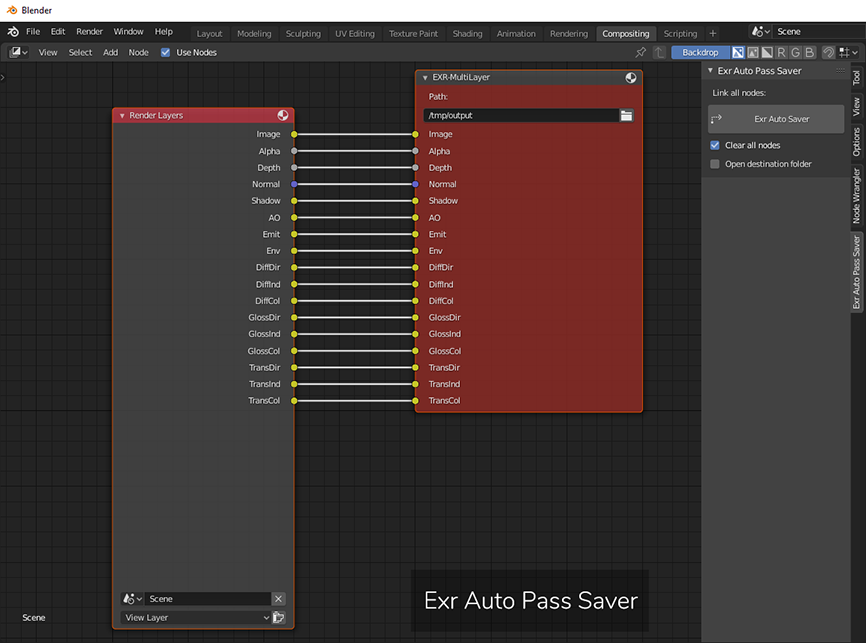
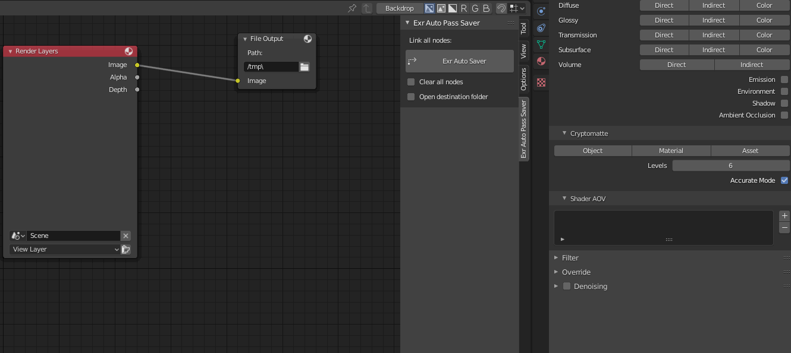
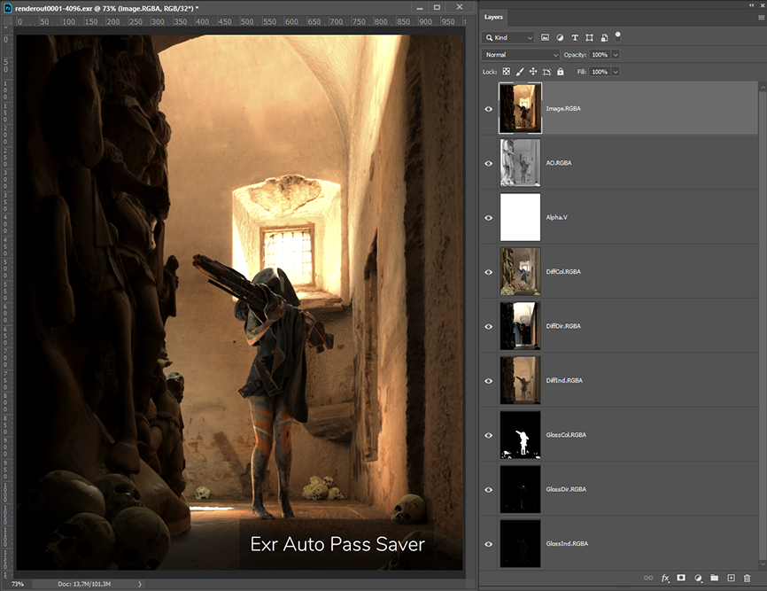

# Blender EXR Auto Pass Saver
Link all render passes in Blender to a new EXR-mulitlayer save node

  

EXR Auto Saver will automatically create a Render Layer Node and EXR File Output node linked together at the default position on the compositor.
 

(v1.1) EXR Auto Linker will automatically link an EXR File Output node to an <b>EXISTING</b> Render Layer node, offset to the right of the existing node.
 

MultiLayer EXR images created in Blender are optimal image editing material for compositing or retouching in applications like Adobe Photoshop, Fusion or Nuke.
 

This script works in combination with any Blender renderer supporting Mulitlayer Pass Nodes. 
They can be imported in Photoshop using Exr-IO importer. 
You can get the free Exr-IO Importer from <b>www.exr-io.com</b> 

# Installation
1. Unzip the folder
2. Edit -> Preferences -> Install Addon:
3. Find the .py file and double click on it
4. In the Addons menu enable the plugin
